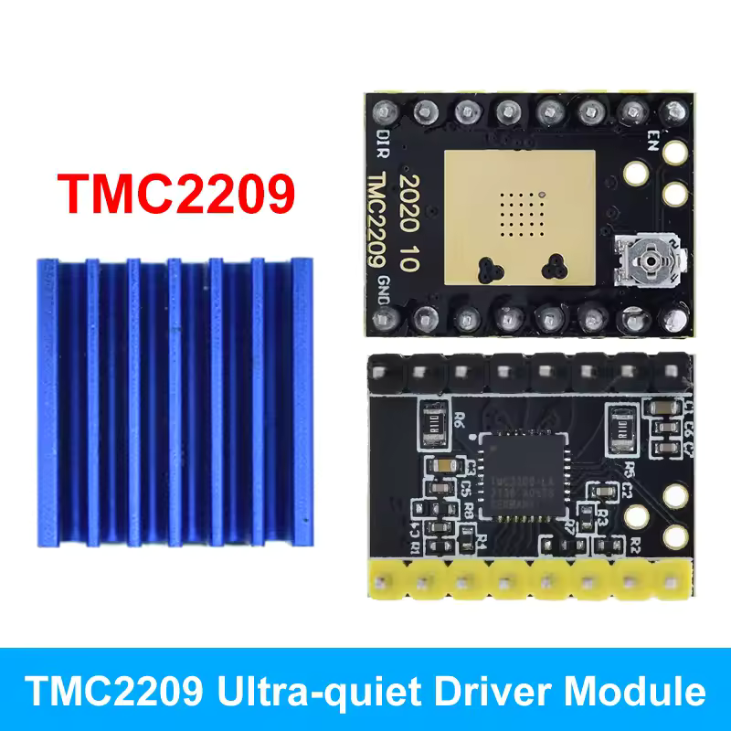

# Generic TMC2209 Module Schematic

This repository contains the schematic for a commonly available generic TMC2209 stepper driver module. These modules are widely available on platforms like AliExpress for approximately £1.5-2 each (including shipping) - notably cheaper than purchasing the ICs alone, even in bulk quantities.

## Module Identification

The module is easily identifiable by its distinctive large rectangular exposed pad and adjustable potentiometer for current limiting. Most of the results on Aliexpress when searching for TMC2209 are this module.

## Purpose

Due to the lack of available documentation for these popular modules online, this repository provides:
- A reverse-engineered schematic
- Component identification
- Pin mappings

## Documentation

The included schematic was created by reverse engineering the physical board. This documentation aims to help makers and hobbyists better understand and integrate these modules into their projects.

